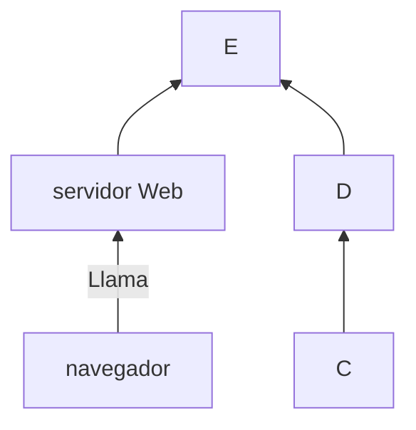

+++
title = 'Markdown'
date = 2024-10-04T13:25:27+02:00
draft = false
weight = 20
+++

## Edición básica

### Títulos

Para establece los títulos usaré la siguiente sintaxis

```makefile
# titulo1
## titulo2
### titulo3
#### titulo4
##### titulo5
###### titulo6
```

Y se verá

--- 

# titulo1
## titulo2
### titulo3
#### titulo4
##### titulo5
###### titulo6
----

### Negrita y formato

Para ver el texto en negrita escribo

```markdown
**Texto en negrita** texto normal
```
### Creando

Para usar un shortcode debes de especificarlo con los siguientes metacaracteres:
```bash
{{`<>}} 
```

PHP es un lenguaje interesante y bonito 
accede a la web



Y se verá

**Texto en negrita** texto normal
   

